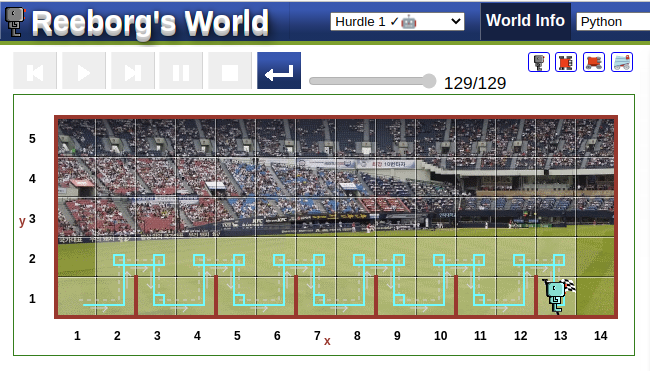

## My Way
```python
def turn_right():
    turn_left()
    turn_left()
    turn_left()

def jump():
    turn_left()
    move()
    turn_right()
    move()
    turn_right()
    move()
    turn_left()

def validate_goal():
    if at_goal() == True:
            break

while at_goal() == False:
    while wall_in_front() == True:
        jump()
        validate_goal()
    while front_is_clear() == True:
        move()
        validate_goal()
```

## Another Way

```python
def turn_right():
    turn_left()
    turn_left()
    turn_left()

def jump():
    turn_left()
    move()
    turn_right()
    move()
    turn_right()
    move()
    turn_left()

while at_goal() == False:
    if wall_in_front() == True:
        jump()
       
    else:
        move()
    
```

**Try yourself**

### Reeborg's World Hurdle 2
[ Reeborg's World ](https://reeborg.ca/reeborg.html?lang=en&mode=python&menu=worlds%2Fmenus%2Freeborg_intro_en.json&name=Hurdle%202&url=worlds%2Ftutorial_en%2Fhurdle2.json)

