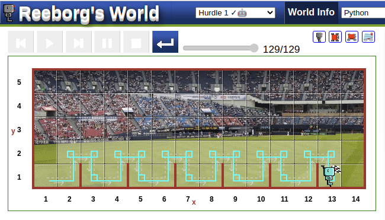

 


**With "for"**

```python
def turn_right():
    turn_left()
    turn_left()
    turn_left()

def jump():
    move()
    turn_left()
    move()
    turn_right()
    move()
    turn_right()
    move()
    turn_right()
    turn_left()
    turn_left()
 
for i in range(1, 7):
    jump()
```


**With "While"**

```python
def turn_right():
    turn_left()
    turn_left()
    turn_left()

def jump():
    move()
    turn_left()
    move()
    turn_right()
    move()
    turn_right()
    move()
    turn_right()
    turn_left()
    turn_left()
 
number_of_hurdles = 6
while  number_of_hurdles > 0:
    jump()
    numbe_of_hurdles -= 1
```