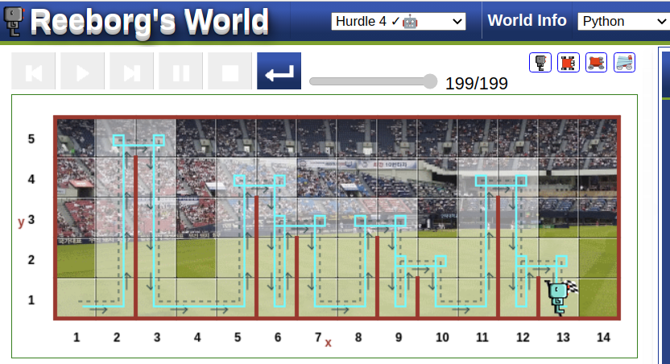

 

```python
def turn_right():
    turn_left()
    turn_left()
    turn_left()

def jump():
    while wall_on_right() == True:
        move()
    turn_right()
    move()
    turn_right()
    while wall_in_front() == False:
        move()
    turn_left()

while at_goal() == False:
    if wall_in_front() == True:
        turn_left()
        jump()
       
    else:
        move()
```

### Reeborg's World Hurdle 4
[ Reeborg's World ](https://reeborg.ca/reeborg.html?lang=en&mode=python&menu=worlds%2Fmenus%2Freeborg_intro_en.json&name=Hurdle%204&url=worlds%2Ftutorial_en%2Fhurdle4.json)