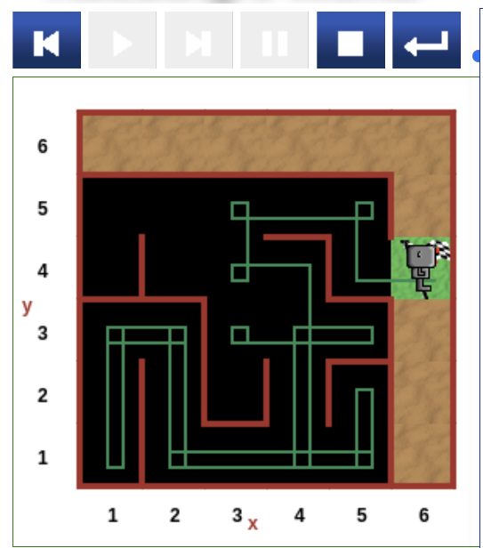

 


**Try by yourself**

### Reeborg's World Hurdle Maze
[ Reeborg's World ](https://reeborg.ca/reeborg.html?lang=en&mode=python&menu=worlds%2Fmenus%2Freeborg_intro_en.json&name=Maze&url=worlds%2Ftutorial_en%2Fmaze1.json)


```python
def turn_right():
    turn_left()
    turn_left()
    turn_left()
   
while at_goal() == False:
        if right_is_clear() == True:
            turn_right()
            move()
        elif wall_in_front() == True and wall_on_right() == True:
            turn_left()
        else:
            move()
```