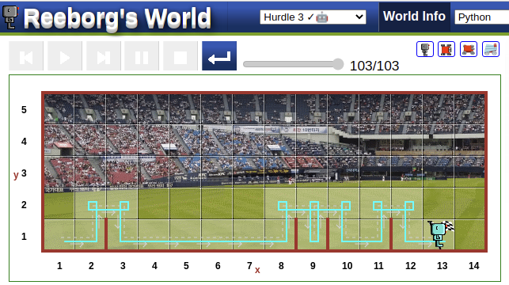

 


```python
def turn_right():
    turn_left()
    turn_left()
    turn_left()

def jump():
    turn_left()
    move()
    turn_right()
    move()
    turn_right()
    move()
    turn_left()

def validate_goal():
    if at_goal() == True:
            break

while at_goal() == False:
    while wall_in_front() == True:
        jump()
        validate_goal()
    while front_is_clear() == True:
        move()
        validate_goal()
```